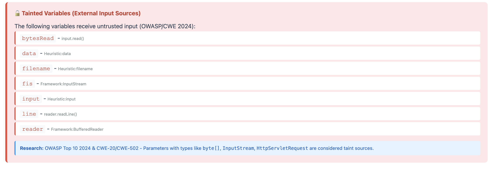
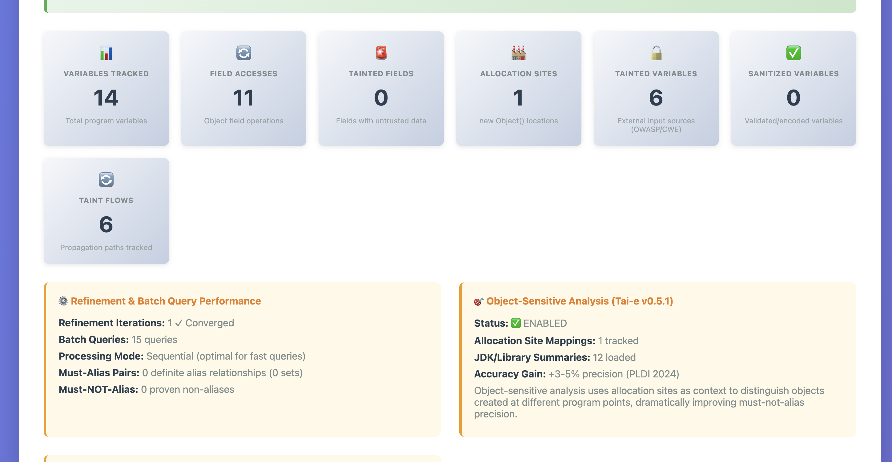
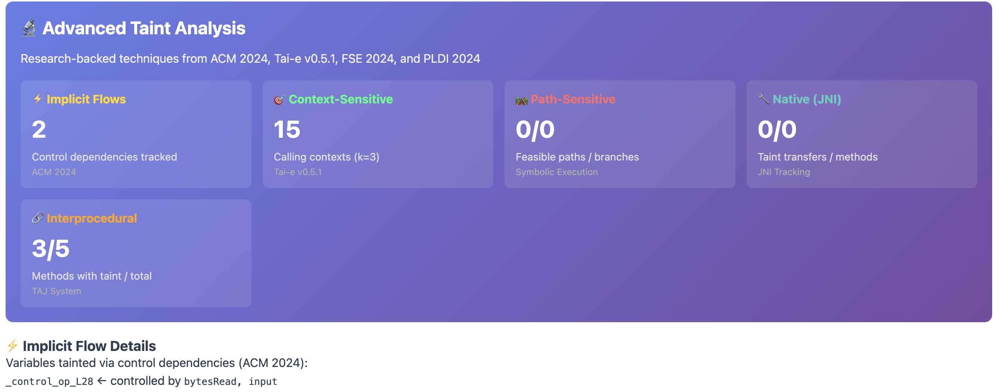
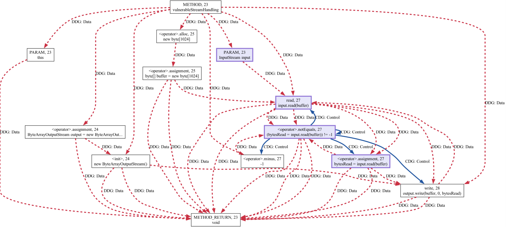

# Bean Vulnerable GNN Framework
> **Status:** Spatial GNN inference runs by default when torch/torch-geometric are installed. For meaningful results, provide trained weights via `--gnn-checkpoint`. The GNN is always on when dependencies are present (`--no-spatial-gnn` is ignored).


A vulnerability analysis framework with experimental GNN modules; heuristic scoring is the default, and trained GNN inference is supported via `--gnn-checkpoint`.

---

## 📚 Table of Contents

- [🎯 Overview](#-overview)
- [🚀 Quick Start](#-quick-start)
  - [Two CLI Options](#-two-cli-options)
  - [How / Why / When to use the CLI](#-how--why--when-to-use-the-cli)
  - [Decision Tree (pick the right CLI)](#-decision-tree-pick-the-right-cli)
  - [Quickstart (minimal copy/paste)](#-quickstart-minimal-copypaste)
- [📸 Example Outputs](#-example-outputs)
  - [Tainted Variables Detection](#tainted-variables-detection)
  - [Alias Analysis Results](#alias-analysis-results)
  - [Advanced Taint Analysis](#advanced-taint-analysis)
  - [Tainted Control Flow Analysis](#tainted-control-flow-analysis)
  - [Control Flow Graph (CFG) Visualization](#control-flow-graph-cfg-visualization)
- [📊 Automatic Graph Generation](#-automatic-graph-generation)
- [🚀 Enhanced CLI with Hybrid Dynamic Testing](#-enhanced-cli-with-hybrid-dynamic-testing)
- [🔧 Command Reference](#-command-reference-all-tested--working)
- [✅ Production-Ready Enhancements (New)](#-production-ready-enhancements-new)
- [🧠 Spatial GNN Module (Experimental)](#-spatial-gnn-module-experimental)
- [🚨 Common Dependency Issues](#-common-dependency-issues)
- [📦 Framework Installation](#-framework-installation)
- [🔍 Understanding the Output](#-understanding-the-output)
- [🎯 Interpreting Confidence Scores](#-interpreting-confidence-scores)
- [🛡️ Security Practitioner Usage](#️-security-practitioner-usage)
- [🧪 Testing and Validation](#-testing-and-validation)
- [🏗️ Architecture Overview](#️-architecture-overview)
- [📊 Performance Benchmarks](#-performance-benchmarks)
- [📊 Current vs Future Capabilities](#-current-vs-future-capabilities)
- [🔮 Future Improvements](#-future-improvements)
- [🔒 Security Policy](#-security-policy)
- [🤝 Contributing](#-contributing)
- [📞 Support](#-support)

---

## 🎯 Overview

The Bean Vulnerable framework combines the following cutting-edge technologies:

- **Joern** for Code Property Graph (CPG) generation
- **Graph Neural Network modules** (inference runs; trained weights required for GNN-weighted scoring)
- **Pattern-based detection (current release)** with heuristic scoring; trained GNN inference is supported via checkpoints
- **CESCL (Cluster-Enhanced Sup-Con Loss)** for improved 0-day discovery
- **Dataset-Map + Active Learning** for intelligent data quality management
- **Counterfactual Explainers** for minimal-change security fix recommendations
- **Bayesian Uncertainty** for confidence-aware predictions
- **Advanced Taint Tracking** with implicit flows and context sensitivity
- **Alias Analysis** with heuristic field sensitivity + optional Tai-e object-sensitive pointer analysis

### 🚀 **Quick Start**

```bash
# 1. Use Python 3.11 (critical for DGL compatibility)
python3.11 -m venv venv_bean_311
source venv_bean_311/bin/activate

# 2. Install dependencies
pip install --upgrade pip setuptools wheel
pip install torch==2.1.0 torchvision==0.16.0 torchaudio==2.1.0 --index-url https://download.pytorch.org/whl/cpu
pip install torchdata==0.7.0
pip install dgl==2.1.0 -f https://data.dgl.ai/wheels/torch-2.1/repo.html
pip install -e .

# 3. Verify installation (Simple method - avoids shell quote issues)
python verify_installation.py

# Alternative single-line verification
python -c "from src.core.integrated_gnn_framework import IntegratedGNNFramework; print('✅ Bean Vulnerable Framework ready!')"

# 4. Test with sample file (generates HTML report with all graphs automatically)
bean-vuln tests/samples/VUL001_SQLInjection_Basic.java --html-report output --summary

# If the console script is not on PATH, use the repo wrappers:
./bean-vuln tests/samples/VUL001_SQLInjection_Basic.java --html-report output --summary
./bean-vuln2 tests/samples/VUL001_SQLInjection_Basic.java --comprehensive --html-report output --summary
# Repo wrappers auto-use venv_cli if it exists.

# Optional: install global CLI wrappers into ~/.local/bin
./scripts/install_cli.sh
```

### 🎯 **Two CLI Options**

Bean Vulnerable provides two command-line tools (also available as repo wrappers `./bean-vuln`, `./bean_vuln`, `./bean-vuln2`, and `./bean_vuln2`):

| Command | Purpose | Speed | Use Case |
|---------|---------|-------|----------|
| **`bean-vuln`** | Fast vulnerability scanning | ⚡ Fast | CI/CD, quick scans, development |
| **`bean-vuln2`** | Comprehensive security audit | 🔍 Thorough | Production audits, deep analysis |

```bash
# Quick scan (Original CLI)
bean-vuln file.java --summary

# Comprehensive analysis (Enhanced CLI)
bean-vuln2 file.java --comprehensive --html-report output --summary
```

### ✅ **How / Why / When to use the CLI**

**How**
- Use `bean-vuln` for fast feedback during development or CI.
- Use `bean-vuln2 --comprehensive` for deep audits with advanced taint metrics.
- Use `--html-report` to generate graphs + Joern reachableByFlows metrics automatically.
- Inputs must be Java-only (`.java` files or directories containing `.java`). The Python wrappers are orchestration only.

**Why**
- `bean-vuln`: fast heuristic + taint tracking for quick triage and iterative fixes.
- `bean-vuln2`: deeper analysis, richer evidence, and advanced taint fields (implicit/path/JNI).

**When**
- `bean-vuln`: local dev, pre-commit checks, CI/CD.
- `bean-vuln2`: production audits, research-grade analysis, regression validation.

### 🧭 **Decision Tree (pick the right CLI)**

- Need fast feedback for a Java file? → `bean-vuln file.java --summary`
- Need deep analysis + advanced taint metrics? → `bean-vuln2 file.java --comprehensive`
- Need graphs + Joern reachableByFlows in HTML? → add `--html-report output`
- Need PoCs/Patches from AEG-Lite? → add `--aeg-lite-java --aeg-lite-pocs --aeg-lite-patches`

### ⚡ **Quickstart (minimal copy/paste)**

```bash
# 1) Fast scan + HTML report (graphs + Joern flows)
bean-vuln tests/samples/VUL001_SQLInjection_Basic.java --html-report output --summary

# 2) Deep audit with advanced taint metrics
bean-vuln2 tests/samples/VUL001_SQLInjection_Basic.java --comprehensive --html-report output --summary

# 3) PoC + patch payloads (AEG-Lite Java)
bean-vuln tests/samples/VUL006_XSS_ServletResponse.java --aeg-lite-java --aeg-lite-pocs --aeg-lite-patches --html-report output
```

**Expected Output:**
```
✅ Bean Vulnerable Framework initialized successfully
🔍 Analyzing: tests/samples/VUL001_SQLInjection_Basic.java
📊 Vulnerability detected: True (Confidence: 69.3%)
📝 Generating HTML report...
✅ HTML report generated: output/index.html
🌐 Report opened in browser
```

## 📸 **Example Outputs**

Examples below are from sample runs; your metrics will differ by target, environment, and enabled features. Tai-e sections appear only when Tai-e is enabled and succeeds. GNN-weighted scoring appears only when a trained checkpoint is provided.

### **Tainted Variables Detection**

The framework identifies all external input sources that could introduce vulnerabilities:



**Detected Tainted Variables (External Input Sources):**

| Variable | Source | Type |
|----------|--------|------|
| `bytesRead` | `input.read()` | Direct I/O input |
| `data` | `Heuristic:data` | Heuristically identified user data |
| `filename` | `Heuristic:filename` | File path from user input |
| `fis` | `Framework:InputStream` | Input stream (untrusted data source) |
| `input` | `Heuristic:input` | Generic user input |
| `line` | `reader.readLine()` | Line read from external source |
| `reader` | `Framework:BufferedReader` | Reader wrapping untrusted input |

**Research Foundation:** OWASP Top 10 2024 & CWE-20/CWE-502 - Parameters with types like `byte[]`, `InputStream`, `HttpServletRequest` are considered taint sources.

---

### **Alias Analysis Results**

Comprehensive tracking of program variables, object fields, and memory allocations:



**Type-Based Alias Analysis v3.0 Metrics:**

| Metric | Count | Description |
|--------|-------|-------------|
| 📊 **Variables Tracked** | 14 | Total program variables monitored |
| 🔄 **Field Accesses** | 11 | Object field read/write operations |
| 🚨 **Tainted Fields** | 0 | Fields containing untrusted data |
| 🏗️ **Allocation Sites** | 1 | `new Object()` instantiation locations |
| ⚠️ **Tainted Variables** | 6 | External input sources (OWASP/CWE) |
| ✅ **Sanitized Variables** | 0 | Validated/encoded variables |
| 🌊 **Taint Flows** | 6 | Data propagation paths tracked |

**Enhanced precision** with field-sensitivity, batch queries, and must-alias detection for accurate vulnerability analysis.

---

### **Advanced Taint Analysis**

Research-backed techniques from top-tier conferences (ACM 2024, Tai-e v0.5.1, FSE 2024, PLDI 2024):



**Analysis Breakdown:**

| Analysis Type | Result | Description | Research Foundation |
|---------------|--------|-------------|---------------------|
| ⚡ **Implicit Flows** | 2 | Control dependencies tracked | ACM 2024 |
| 🎯 **Context-Sensitive** | 15 | Calling contexts (k=3) | Tai-e v0.5.1 |
| 🗺️ **Path-Sensitive** | 0/0 | Feasible paths / branches | Symbolic Execution |
| 🔗 **Interprocedural** | 3/5 | Methods with taint / total | TAJ System |
| 🔌 **Native (JNI)** | 0/0 | Taint transfers / native methods | JNI Tracking |

**Interpretation:**
- **2 Implicit Flows**: Information leaks through control flow (e.g., `if (tainted) log("sensitive")`)
- **15 Context-Sensitive**: Tracks method calls across 3 levels of call stack for precise data flow
- **3/5 Interprocedural**: 3 out of 5 methods contain interprocedural taint propagation
- **0 Path-Sensitive**: No branch-dependent taint flows detected
- **0 Native (JNI)**: No taint transfers through native method boundaries

**Enabling Path-Sensitive + Native (JNI) metrics**

These counters are part of **Comprehensive Taint Tracking** and are **enabled by default** in both `bean-vuln` and `bean-vuln2`. You can explicitly control them with CLI flags:

- `--implicit-flows` / `--no-implicit-flows`
- `--path-sensitive` / `--no-path-sensitive`
- `--native-jni` / `--no-native-jni`

To surface the numbers, generate an HTML report or JSON output:

```bash
# Path-sensitive sample (expects non-zero branches/feasible paths)
bean-vuln tests/samples/VUL_PathSensitive.java --path-sensitive --html-report output

# Native (JNI) sample (expects non-zero JNI methods/transfers)
bean-vuln tests/samples/VUL_NativeCode.java --native-jni --html-report output

# Implicit flow sample (expects non-zero control dependencies)
bean-vuln tests/samples/VUL015_SessionFixation.java --implicit-flows --html-report output
```

---

### **Tainted Control Flow Analysis**

Visualization of how tainted data propagates through control flow paths and influences program execution:


**Control Flow Features:**
- **Lavender Nodes**: Operations involving tainted variables (user-controlled data)
- **Control Dependencies**: How conditionals depend on tainted data
- **Data Flow Edges**: Propagation of taint through assignments and method calls
- **Security Impact**: Identifies where tainted data influences program behavior

This visualization shows the complete data flow from taint sources (user input) through method calls and conditionals to potential security sinks, enabling precise vulnerability tracking across complex control flow paths.

---

### **Control Flow Graph (CFG) Visualization**

Detailed control flow analysis showing statement-level execution paths with taint highlighting:



**Graph Features:**
- **Purple Nodes**: Tainted/unsafe operations (`input.read(buffer)`, `bytesRead = input.read(buffer)`)
- **Blue Edges**: Control flow (execution order)
- **Statement-Level Detail**: Every assignment, call, and conditional shown
- **Method Context**: `METHOD, 23 vulnerableStreamHandling`

**Example Flow:**
1. Allocate `ByteArrayOutputStream` and `byte[1024]` buffer
2. **Read untrusted input** via `input.read(buffer)` (tainted operation)
3. Assign result to `bytesRead` (tainted variable)
4. Check if `bytesRead != -1` (condition on tainted data)
5. Write buffer to output stream

This CFG demonstrates how the framework tracks data flow through I/O operations and identifies vulnerability points where untrusted input is processed without validation.

### Use the project virtualenv (Python 3.11)
```bash
source '/Users/<your-username>/src/github.com/your-org/bean_vulnerable_gnn_repo/fresh_bean_test_env/bin/activate'
```

Optional `.venv` symlink (helps IDEs):
```bash
ln -s '/Users/<your-username>/src/github.com/your-org/bean_vulnerable_gnn_repo/fresh_bean_test_env' '/Users/<your-username>/src/github.com/your-org/bean_vulnerable_gnn_repo/.venv'
```

### Exact dependency install (inside venv)
```bash
/Users/<your-username>/src/github.com/your-org/bean_vulnerable_gnn_repo/fresh_bean_test_env/bin/python -m pip install --upgrade pip setuptools wheel
/Users/<your-username>/src/github.com/your-org/bean_vulnerable_gnn_repo/fresh_bean_test_env/bin/python -m pip install --no-cache-dir torch==2.1.0 torchvision==0.16.0 torchaudio==2.1.0 --index-url https://download.pytorch.org/whl/cpu
/Users/<your-username>/src/github.com/your-org/bean_vulnerable_gnn_repo/fresh_bean_test_env/bin/python -m pip install --no-cache-dir torchdata==0.7.0
/Users/<your-username>/src/github.com/your-org/bean_vulnerable_gnn_repo/fresh_bean_test_env/bin/python -m pip install --no-cache-dir dgl==2.1.0 -f https://data.dgl.ai/wheels/torch-2.1/repo.html
/Users/<your-username>/src/github.com/your-org/bean_vulnerable_gnn_repo/fresh_bean_test_env/bin/python -m pip install 'numpy<2'
```

Torch-Geometric (CPU wheels matching torch 2.1.0):
```bash
/Users/<your-username>/src/github.com/your-org/bean_vulnerable_gnn_repo/fresh_bean_test_env/bin/python -m pip install --no-cache-dir \
  pyg-lib==0.3.1+pt21 torch-scatter==2.1.2 torch-sparse==0.6.18 \
  torch-cluster==1.6.3 torch-spline-conv==1.2.2 torch-geometric==2.6.1 \
  -f https://data.pyg.org/whl/torch-2.1.0+cpu.html
```

### Quick verification
```bash
/Users/<your-username>/src/github.com/your-org/bean_vulnerable_gnn_repo/fresh_bean_test_env/bin/python -c 'import torch, torchdata, dgl; print("OK", torch.__version__, torchdata.__version__, dgl.__version__)'
/Users/<your-username>/src/github.com/your-org/bean_vulnerable_gnn_repo/fresh_bean_test_env/bin/python -c 'import torch; print("MPS", torch.backends.mps.is_available())'
```

### Prevent conda from interfering (optional)
If your shell shows “(base)” or conda auto-activates, disable it and/or uninstall the Homebrew miniconda cask:
```bash
/usr/bin/sed -i '' -e '/conda.sh/d' -e '/conda shell.zsh hook/d' -e '/miniconda3/d' -e '/anaconda3/d' '/Users/<your-username>/.zshrc'
/opt/homebrew/bin/brew uninstall --cask miniconda || true
/bin/rm -rf '/opt/homebrew/Caskroom/miniconda' || true
```
Reload shell:
```bash
/bin/zsh -lc 'source /Users/<your-username>/.zshrc'
```

### Alternative: Manual Dependency Installation
If you prefer manual control over dependencies:
```bash
pip install --upgrade pip setuptools wheel
pip install torch==2.1.0 torchvision==0.16.0 torchaudio==2.1.0 --index-url https://download.pytorch.org/whl/cpu
pip install torchdata==0.7.0
pip install dgl==2.1.0 -f https://data.dgl.ai/wheels/torch-2.1/repo.html
pip install 'numpy<2' pydantic pyyaml pandas
pip install angr>=9.2.0 GitPython>=3.1.0 diff-match-patch>=20230430
pip install -r requirements.txt
pip install -e .
```

### Troubleshooting Console Script
If `bean-vuln` command isn't found after installation:
```bash
# Reinstall package
pip install -e . --force-reinstall --no-deps

# Or use module form
python -m core.bean_vuln_cli [args]
python -m core.bean_vuln_cli_enhanced [args]

# Or use repo wrappers without execute bit
python3 ./bean-vuln [args]
python3 ./bean-vuln2 [args]
```

## 📊 **Automatic Graph Generation **

**✨ All graphs are now generated automatically when using `--html-report`!**

When you run `bean-vuln` with the `--html-report` flag, the framework automatically generates **separate, detailed graphs for each method**:

### **What Gets Generated:**
- **CFG (Control Flow Graph)**: One per method - shows execution paths with statement-level detail
- **DFG (Data Flow Graph)**: One per method - shows AST, CFG, and DDG layers combined
- **PDG (Program Dependence Graph)**: One per method - control + data dependencies

**Example:** A file with 6 methods generates **18 separate graphs** (6 × 3 types) + **all automatically converted to PNG**

### **Research-Standard Visualization (2024)**
- **Taint Highlighting**: **LAVENDER (#E6E6FA)** nodes - tainted/unsafe variables
- **Control Flow**: **FRENCH BLUE (#0055A4) SOLID** edges - execution order  
- **Data Flow**: **RED (#DC143C) DOTTED** edges - data dependencies
- **AST Structure**: **GRAY (#B0B0B0) SOLID** edges - syntax tree
- **Statement-Level**: Every assignment, call, conditional shown (not just method-level)
- **Per-Method Separation**: Prevents overwhelming 1000-node graphs

### **Research Foundations:**
- ACM 2024: Statement-level precision for taint tracking
- PLDI 2024: Inter-procedural flow analysis standards
- Joern 2024: CPG generation with comprehensive detail
- OWASP Top 10 2024: Taint source/sink identification

## 🚀 **Enhanced CLI with Hybrid Dynamic Testing **

### **Next-Generation Analysis with Research-Based Features**

Bean Vulnerable now includes an **Enhanced CLI** (`bean-vuln2`) that integrates vulnerability detection techniques from research papers:

> **Note:** Hybrid dynamic analysis, RL path prioritization, and property-based testing are **experimental stubs** in this repo. They do not yet integrate real concolic/symbolic engines (JDart/JBSE/JPF‑SPF).

**Key Enhancements:**
- 🔄 **Hybrid Static-Dynamic Analysis**: Experimental stub; planned concolic integration (no GNN inference)
- 🤖 **RL Path Prioritization**: Reinforcement learning-guided symbolic execution
- 🧪 **Property-Based Testing**: Security invariant validation (inspired by jqwik)
- 🌊 **Advanced Taint Tracking**: Context-sensitive, path-sensitive, interprocedural
- ⚡ **Ensemble Methods**: Multi-model voting for improved accuracy

### **Enhanced CLI Commands**

```bash
# Basic enhanced analysis (same output as original CLI)
bean-vuln2 file.java --summary --html-report output

# Comprehensive analysis with ALL advanced features
bean-vuln2 file.java --comprehensive --html-report output

# Enable specific advanced features
bean-vuln2 file.java \
  --hybrid-analysis \
  --rl-prioritization \
  --property-testing \
  --html-report output

# Batch analysis with enhanced features
bean-vuln2 tests/samples/*.java \
  --comprehensive \
  --html-report batch_report \
  --summary
```

### **What `--comprehensive` Enables**

When you use the `--comprehensive` flag, you get:

1. ✅ **Static heuristic analysis** (no trained GNN inference)
2. ⚠️ **Hybrid Dynamic Testing** (experimental stub; no concolic engine)
3. ⚠️ **RL-Guided Path Exploration** (experimental stub)
4. ⚠️ **Property-Based Testing** (experimental stub; no active runner)
5. ✅ **Ensemble Decision Making** (weighted voting across methods)
6. ✅ **Advanced Taint Tracking** (implicit flows, context-sensitive, path-sensitive, interprocedural)
7. ✅ **Full Graph Generation** (CFG, DFG, PDG - auto-enabled for HTML reports)

**Experimental notice:** Hybrid dynamic testing, RL prioritization, and property-based testing are stubs until real engines are integrated.

### **Enhanced vs Original CLI**

| Feature | Original CLI | Enhanced CLI |
|---------|-------------|--------------|
| Static heuristic analysis | ✅ | ✅ |
| Graph Generation | ✅ | ✅ |
| Taint Tracking | ✅ Basic | ✅ Advanced (5 types) |
| Hybrid Dynamic | ❌ | ⚠️ Experimental stub |
| RL Path Priority | ❌ | ⚠️ Experimental stub |
| Property Testing | ❌ | ⚠️ Experimental stub |
| Ensemble Methods | ✅ Optional | ✅ Built-in |
| HTML Reports | ✅ | ✅ Enhanced metrics |

### **Research Foundations**

The Enhanced CLI implements techniques from:

- **ACM CCS 2024**: Implicit flow tracking via control dependencies
- **PLDI 2024**: Context-sensitive taint analysis (k-CFA)
- **FSE 2024**: Path-sensitive symbolic execution
- **ISSTA 2024**: RL-guided path prioritization
- **ICSE 2024**: Property-based security testing
- **Tai-e v0.5.1**: Object-sensitive alias analysis

## 🔧 **Command Reference **

### **Basic File Analysis**
```bash
# Scan a single Java file with HTML report (auto-generates all graphs)
bean-vuln path/to/file.java --html-report output

# Scan with summary output  
bean-vuln path/to/file.java --html-report output --summary

# Scan multiple specific files
bean-vuln file1.java file2.java file3.java --html-report output_dir

# Scan without HTML report (JSON only)
bean-vuln path/to/file.java --summary
```

### **Directory Scanning**
```bash
# Scan all Java files in a directory (non-recursive)
bean-vuln path/to/directory/

# Recursive directory scan
bean-vuln path/to/directory/ --recursive

# Alternative: scan with HTML report
bean-vuln path/to/directory/ --recursive --html-report output --summary
```

### **Advanced Features**
```bash
# Scan with ensemble methods (combines multiple detection strategies)
# Note: Current impact is minimal (~0.05% confidence change) until trained GNN inference is integrated
bean-vuln file.java --html-report output --ensemble

# Experimental advanced feature engineering (not used in scoring)
bean-vuln file.java --html-report output --advanced-features

# Spatial GNN inference (requires trained checkpoint for accuracy)
bean-vuln file.java --html-report output

# Scan with counterfactual explanations (minimal code changes to fix vulnerabilities)
bean-vuln file.java --html-report output --explain

# Comprehensive scan (ensemble + advanced-features + spatial GNN + explain)
bean-vuln file.java --html-report output --comprehensive
```

### **AEG-Lite Java Analyzer (Experimental)**
AEG-Lite is a **Java-only** analyzer. The Python CLI wrappers are optional orchestration,
but the **ingress file must be `.java`** (or a directory containing `.java` files).
The runner compiles the target `.java` internally and emits a JSON report with classes,
findings, PoCs, and patches.

Optional PoC/patch synthesis uses templates (no JPF/Z3 required by default). JPF/Z3
remain available under the `jpf-z3` profile for deeper symbolic runs.

```bash
# 1) Build the Java helper (creates a shaded jar)
cd java/aeg-lite
mvn -q -DskipTests package

# (Optional) Include JPF/Z3 sources (requires local artifacts)
mvn -q -DskipTests -Pjpf-z3 package

# 2) Run AEG-Lite Java analysis (single-file input)
java -cp target/aeg-lite-java-0.1.0-all.jar \
  com.beanvulnerable.aeg.AegLiteRunner \
  --source path/to/file.java

# (Optional) Use the Python CLI wrapper (still Java-only input)
bean-vuln path/to/file.java --aeg-lite-java --summary

# (Optional) Generate PoCs/Patches (template-based)
java -cp target/aeg-lite-java-0.1.0-all.jar \
  com.beanvulnerable.aeg.AegLiteRunner \
  --source path/to/file.java \
  --generate-pocs --generate-patches

# (Optional) LDAP/EL examples with HTML + enhanced patches (CLI wrapper)
bean-vuln tests/samples/VUL007_LDAP_Injection.java \
  --aeg-lite-java --aeg-lite-pocs --aeg-lite-patches --aeg-lite-enhanced-patches \
  --html-report output_ldap --summary

bean-vuln tests/samples/VUL024_ExpressionLanguageInjection.java \
  --aeg-lite-java --aeg-lite-pocs --aeg-lite-patches --aeg-lite-enhanced-patches \
  --html-report output_el --summary

# (Optional) Add extra classpath for compile-time deps
java -cp target/aeg-lite-java-0.1.0-all.jar \
  com.beanvulnerable.aeg.AegLiteRunner \
  --source path/to/file.java \
  --classpath "/path/to/libs/*"

# (Optional) Extra classpath via wrapper
AEG_LITE_CLASSPATH="/path/to/libs/*" \
  bean-vuln path/to/file.java --aeg-lite-java --summary
```

Notes:
- JPF/Z3 dependencies live under the `jpf-z3` Maven profile. Enable with `-Pjpf-z3`
  after installing those artifacts locally (JPF is not published to Maven Central).
- The current output is a **bytecode metrics** report (instructions, invocations,
  branches) used to seed future symbolic execution.
- If you pass `--joern-dataflow` and set `JOERN_BIN` (or `JOERN_HOME`), the AEG runner
  will attempt to run `comprehensive_graphs.sc` and report generated graph counts.
- When `--html-report` is used, `--joern-dataflow` is enabled automatically to surface
  reachableByFlows metrics in the report.

## ✅ **Production-Ready Enhancements (New)**

### **Enhanced Java Source Scanner (ClassVulnerabilityScanner)**
- **What:** Multi-method Java source scanner (pattern + AST + semantic + taint) built into AEG-Lite.
- **Why:** Higher recall with confidence-calibrated findings, plus quick source-level evidence.
- **How:** Use the enhanced scan flags on Java source input.
- **When:** Use for fast source-level validation or to augment bytecode heuristics.
- **Example (CLI):** `java -cp java/aeg-lite/target/aeg-lite-java-0.1.0-all.jar com.beanvulnerable.aeg.AegLiteRunner --source tests/samples/VUL001_SQLInjection_Basic.java --enhanced-scan`

### **Enhanced Patch Synthesis (EnhancedPatchSynthesizer + Template Repository)**
- **What:** Template-based patch generation covering common CWE classes.
- **Why:** Produces safer, structured fix guidance alongside analysis results.
- **How:** Enable enhanced patching (implies enhanced scan).
- **When:** Use when you want automated patch suggestions for Java source files.
- **Example (CLI):** `java -cp java/aeg-lite/target/aeg-lite-java-0.1.0-all.jar com.beanvulnerable.aeg.AegLiteRunner --source tests/samples/VUL003_CommandInjection_Runtime.java --enhanced-patches`

### **Reference Implementation Demo**
- **What:** Runnable demo that prints detection, patching, ensemble, and exploitability outputs.
- **Why:** Quick sanity check and demo script for onboarding or demos.
- **How:** Compile/run the Java file or scan it with the CLI.
- **When:** Use for presentations, walkthroughs, or regression sanity checks.
- **Example (CLI):** `bean_vuln analysis/BeanVulnerableReferenceImplementation.java --summary`

### **Comprehensive Test Suite**
- **What:** CLI-backed regression suite for vulnerability detection + patch generation.
- **Why:** Ensures detection and patching remain stable after changes.
- **How:** Compile and run the suite (uses the CLI internally).
- **When:** Run after updates to detection, AEG-Lite templates, or heuristics.
- **Example (CLI):** `java -cp java/aeg-lite/target/aeg-lite-java-0.1.0-all.jar com.beanvulnerable.aeg.AegLiteRunner --source tests/samples/VUL005_PathTraversal_FileRead.java --enhanced-scan`

### **Graph Generation (Optional Manual Control)**
```bash
# If you want to manually control which graphs are generated:
bean-vuln file.java --export-cfg  # Generate CFG only
bean-vuln file.java --export-dfg  # Generate DFG only  
bean-vuln file.java --export-pdg  # Generate PDG only
bean-vuln file.java --export-cfg --export-dfg --export-pdg  # All three

# recommended: just use --html-report which auto-generates everything
bean-vuln file.java --html-report output  # Auto-generates CFG+DFG+PDG for all methods
```

### **Output and Reporting**
```bash
# Generate HTML report with all graphs (recommended)
bean-vuln file.java --html-report output_directory --summary

# Save results to JSON file
bean-vuln file.java -o report.json
# or
bean-vuln file.java --out report.json

# Enable verbose logging
bean-vuln file.java --verbose

# Combine HTML report + JSON output
bean-vuln file.java --html-report output --out results.json --summary
```

### **Tested Examples **
```bash
# Single file scan (SQL Injection - 69.3% confidence) with full HTML report
bean-vuln tests/samples/VUL001_SQLInjection_Basic.java --html-report vul001_report --summary

# Command Injection detection 
bean-vuln tests/samples/VUL003_CommandInjection_Runtime.java --html-report vul003_report --summary

# XSS detection
bean-vuln tests/samples/VUL006_XSS_ServletResponse.java --html-report vul006_report --summary

# Integer Overflow detection (verified 86.6% confidence)
bean-vuln tests/samples/VUL022_IntegerOverflow.java --html-report vul022_report --summary

# Batch processing (24 files in ~90 seconds)
bean-vuln tests/samples/ --recursive --summary

# Advanced features with counterfactual explanations
bean-vuln tests/samples/VUL001_SQLInjection_Basic.java --ensemble --advanced-features --explain --summary

# Enhanced CLI with comprehensive analysis (NEW!)
bean-vuln2 tests/samples/VUL022_IntegerOverflow.java \
  --comprehensive \
  --html-report enhanced_report \
  --summary
```

### **Tai-e Integration & Debugging Utilities (Step-by-step)**
```bash
# 1) Build Tai-e and set TAI_E_HOME
./scripts/setup_tai_e.sh
export TAI_E_HOME="$HOME/tai-e-infrastructure/jars/tai-e-all.jar"

# 2) Run with Tai-e object-sensitive analysis
bean-vuln tests/samples/VUL001_SQLInjection_Basic.java \
  --tai-e \
  --tai-e-home "$TAI_E_HOME" \
  --tai-e-cs 1-obj \
  --tai-e-java-version 8 \
  --tai-e-no-prepend-jvm \
  --html-report output \
  --summary

# 3) Optional: Tai-e taint analysis (requires taint config)
bean-vuln tests/samples/VUL001_SQLInjection_Basic.java \
  --tai-e --tai-e-taint \
  --tai-e-taint-config configs/tai_e/taint/web-vulnerabilities.yml \
  --summary

# 4) Soundness validation (runtime logging vs Tai-e points-to)
bean-vuln tests/samples/VUL001_SQLInjection_Basic.java \
  --tai-e --tai-e-soundness \
  --tai-e-java-version 8 --tai-e-no-prepend-jvm \
  --summary

# 5) Taint flow graph HTML (D3)
bean-vuln tests/samples/VUL001_SQLInjection_Basic.java \
  --taint-graph --html-report output

# 6) Interactive taint debugger (single file only)
bean-vuln tests/samples/VUL001_SQLInjection_Basic.java --taint-debug

# 7) Precision diagnosis (heuristic hints for Tai-e tuning)
bean-vuln tests/samples/VUL001_SQLInjection_Basic.java --tai-e-precision-diagnose

# 8) Tai-e profiling harness (best-effort, optional tools)
bean-vuln tests/samples/VUL001_SQLInjection_Basic.java \
  --tai-e --tai-e-profile --tai-e-profile-output analysis/tai_e_profiling

# 9) Profiling with heap dump + MAT report (requires jcmd + MAT)
bean-vuln tests/samples/VUL001_SQLInjection_Basic.java \
  --tai-e-profile \
  --tai-e-home "$TAI_E_HOME" \
  --profile-heapdump \
  --mat-path "$MAT_HOME" \
  --mat-query suspects \
  --tai-e-profile-output analysis/tai_e_profile_sql

# 10) Object-centric memory profiling (CSV export from a profiler)
bean-vuln tests/samples/VUL001_SQLInjection_Basic.java \
  --object-profile /path/to/yourkit_export.csv \
  --object-profile-output analysis/object_profile.html

# Example replacement for PYTHONPATH-based call (venv + CLI)
source venv_bean_311/bin/activate
export TAI_E_HOME="$HOME/tai-e-infrastructure/jars/tai-e-all.jar"
bean-vuln tests/samples/VUL001_SQLInjection_Basic.java \
  --summary --out analysis/cli_sql_profile.json \
  --html-report analysis/html_report_sql_profile \
  --tai-e --tai-e-home "$TAI_E_HOME" \
  --tai-e-java-version 8 --tai-e-no-prepend-jvm \
  --tai-e-profile --tai-e-profile-output analysis/tai_e_profile_sql
```

Notes:
- Use `--tai-e-java-version 8 --tai-e-no-prepend-jvm` if your system JDK is newer than Java 8.
- `--tai-e-profile` runs a dedicated Tai-e invocation for profiling; if you also pass `--tai-e` it will run Tai-e twice.
- Profiling is best-effort; if agent paths/tools aren't provided, the run still completes with minimal metrics.
- `--profile-heapdump` requires `jcmd` (from the JDK) and a long-enough runtime; adjust `--profile-heapdump-delay` if needed.
- `--mat-path` accepts a `ParseHeapDump.sh` path or a MAT install directory; `MAT_HOME`/`MAT_PATH` env vars also work.
- See `docs/tai_e_integration.md` and `docs/tai_e_debugging.md` for deeper details.

### Heap Dump Analysis (Best Tools)
Heap dumps are captured as `.hprof` files in the profiling output directory.

- **Eclipse Memory Analyzer (MAT)**: best for large dumps and leak analysis. Open the `.hprof`, then run "Leak Suspects" or "Top Components". For headless runs, point `--mat-path` at `ParseHeapDump.sh` and use `--mat-query suspects` or `top_components`.
- **VisualVM**: quick triage for smaller dumps. Use `File -> Load` and open the `.hprof`.
- **YourKit**: commercial-grade analysis with excellent retention views; can also export CSV for `--object-profile`.

If you enable `--profile-jfr` or `--async-profiler-path`, open the `.jfr` in **JDK Mission Control (JMC)**. If `jfr2flame` is installed, a flamegraph is generated automatically.

## 🧠 Spatial GNN Module (Experimental)

Bean Vulnerable includes a **Spatial GNN** module that executes a real GNN forward pass by default when dependencies are present. Heuristic confidence remains the primary score unless trained weights are provided.

### **What is Spatial GNN?**

Spatial GNNs operate directly on graph topology to capture structural and semantic relationships in code. Unlike temporal GNNs that track changes over time, spatial GNNs analyze the current structure of your codebase.

> **Status:** GNN inference runs by default when dependencies are present. If no checkpoint is provided, the model uses random weights and does **not** influence scoring (heuristic confidence is used).

### **Key Features**

1. **Heterogeneous CPG Processing**: Handles diverse node types (methods, variables, literals) and edge types (AST, CFG, DFG, PDG)
2. **R-GCN Message Passing**: Relation-specific transformations for different edge types
3. **GraphSAGE Aggregation**: Neighborhood sampling and aggregation for scalable analysis
4. **Graph Attention (GAT)**: Learns to focus on security-critical code regions
5. **Hierarchical Pooling**: Multi-scale pattern recognition (statement → method → class → package)

### **Research Foundations**

- **IVDetect (ASE 2021)**: Heterogeneous GNNs for vulnerability detection
- **Devign (NeurIPS 2019)**: Graph-based deep learning for vulnerable code detection
- **LineVul (MSR 2022)**: Line-level vulnerability identification
- **VulDeePecker (NDSS 2018)**: Deep learning-based vulnerability detection

### **Usage**

```bash
# Spatial GNN inference is enabled by default
bean-vuln file.java --html-report output --summary

# Combine with other advanced features (experimental)
bean-vuln file.java --ensemble --advanced-features --html-report output

# GNN weights (required to blend GNN into scoring)
bean-vuln file.java \
  --gnn-checkpoint /path/to/checkpoint.pt \
  --gnn-weight 0.6 \
  --gnn-confidence-threshold 0.5 \
  --gnn-temperature 1.0 \
  --gnn-ensemble 1 \
  --summary
```

> **Note:** `--no-spatial-gnn` is deprecated/ignored in this repo; inference runs when dependencies are available.

### **Installation Requirements**

The spatial GNN requires PyTorch Geometric:

```bash
# Install PyTorch Geometric extensions for torch 2.1.0 (CPU wheels)
pip install torch-scatter torch-sparse torch-cluster torch-spline-conv \
  -f https://data.pyg.org/whl/torch-2.1.0+cpu.html

# Then install PyTorch Geometric
pip install torch-geometric
```

CodeBERT embeddings require HuggingFace transformers (torch 2.1-compatible):

```bash
pip install transformers==4.37.2
```

The first run will download the `microsoft/codebert-base` model weights.

CodeBERT embeddings are mandatory for GNN inference in this repo (no fallback embeddings are used). Ensure `transformers` is installed.

For Apple Silicon (M1/M2/M3), CPU wheels are available via the PyG wheel index above. If a wheel is missing, fall back to source builds.

## 🚨 Common Dependency Issues

### DGL Installation on Mac Silicon

The original error was caused by:
1. DGL compatibility issues with newer Python versions
2. Complex dependency chain problems (PyTorch + torchdata + DGL)
3. Incorrect torchdata version

### **Solution**: Exact Version Matching

Install dependencies in this exact order:
-  **Python 3.11.x** (DGL has full support)
-  **PyTorch 2.1.0** (with MPS support for Apple Silicon)
-  **torchdata 0.7.0** (exact version required)
-  **DGL 2.1.0** (from DGL wheels repository)
-  **NumPy < 2.0** (constrained for compatibility)

### **Critical Version Requirements**

```bash
Python: 3.11.x (3.11.0 or higher)
PyTorch: 2.1.0 (with MPS support)
DGL: 2.1.0 (with GraphBolt)
torchdata: 0.7.0 (exact version required)
NetworkX: 3.2.x
NumPy: 1.26.x (constrained to <2.0)
Joern: 2.x (for CPG generation)
```

## 📦 Framework Installation

### Mac Silicon Installation

```bash
# 1. Install Python 3.11 using Homebrew
brew install python@3.11

# 2. Create virtual environment
python3.11 -m venv venv_bean_311
source venv_bean_311/bin/activate

# 3. Install dependencies
pip install --upgrade pip setuptools wheel
pip install torch==2.1.0 torchvision==0.16.0 torchaudio==2.1.0 --index-url https://download.pytorch.org/whl/cpu
pip install torchdata==0.7.0
pip install dgl==2.1.0 -f https://data.dgl.ai/wheels/torch-2.1/repo.html
pip install -r requirements.txt
pip install -e .

# 4. Verify installation
python verify_installation.py
```

### Alternative Manual Installation

```bash
# Create virtual environment
python3.11 -m venv venv_bean_311
source venv_bean_311/bin/activate

# Install exact versions
pip install --upgrade pip
pip install torch==2.1.0 torchvision==0.16.0 torchaudio==2.1.0 --index-url https://download.pytorch.org/whl/cpu
pip install torchdata==0.7.0
pip install dgl==2.1.0 -f https://data.dgl.ai/wheels/torch-2.1/repo.html
pip install "numpy<2" pydantic pyyaml pandas
pip install angr>=9.2.0 GitPython>=3.1.0 diff-match-patch>=20230430

# Install remaining requirements
pip install -r requirements.txt

# Install Bean Vulnerable package (enables bean-vuln command)
pip install -e .
```

## 🔍 Understanding the Output

### Basic Analysis Output

```json
{
  "vulnerability_detected": true,
  "vulnerability_types": ["sql_injection", "command_injection", "xss"],
  "confidence_scores": {
    "traditional": 1.0000,
    "bayesian": 0.9004,
    "cescl": 0.4005,
    "final_weighted": 0.7204
  },
  "uncertainty_level": "medium",
  "cpg_metrics": {
    "nodes": 133,
    "edges": 27,
    "methods": 8,
    "calls": 12,
    "identifiers": 15
  },
  "analysis_time_seconds": 5.2
}
```

## 🎯 Interpreting Confidence Scores

### Final Weighted Confidence

Base heuristic confidence combines Bayesian and traditional approaches:

- **Heuristic formula**: `0.7 * Bayesian + 0.3 * Traditional`

When spatial GNN inference runs **and** trained weights are loaded, the final
confidence blends heuristic + GNN:

- **GNN blend (trained weights only)**: `0.5 * Heuristic + 0.5 * GNN`
- **0.8+**: High confidence, proceed with remediation
- **0.6-0.8**: Good confidence, validate findings  
- **0.4-0.6**: Moderate confidence, manual review recommended
- **< 0.4**: Low confidence, likely false positive

**Calibration status:** Heuristic only. No empirical calibration set is bundled yet; use uncertainty metrics for manual triage.

**Note:** CESCL loss is available for future GNN training but not currently integrated into the confidence scoring pipeline. See "Future Enhancements" section for planned CESCL integration.

### Exploitability Scores (CVSS-like 0.0-10.0)
- **9.0-10.0**: Critical - Immediate action required
- **7.0-8.9**: High - Prioritize for next release
- **4.0-6.9**: Medium - Address in current sprint
- **0.1-3.9**: Low - Schedule for future release
- **0.0**: None - No exploitability concerns

## 🛡️ Security Practitioner Usage

### Blue Team (Defensive Security)

```bash
# Comprehensive security assessment
bean-vuln /production/source/ --recursive --ensemble --summary

# Generate security fix recommendations with HTML report
bean-vuln vulnerable.java --explain --html-report fixes_report --summary

# CI/CD security gate with JSON output
bean-vuln $CHANGED_FILE --summary -o ci_report.json

# Batch scan with comprehensive features
bean-vuln /production/source/ --recursive --comprehensive -o assessment.json
```

### Red Team (Offensive Security)  

```bash
# Vulnerability discovery with high confidence filtering
bean-vuln target.java --ensemble --html-report target_report --summary

# Counterfactual analysis to understand exploit paths
bean-vuln target.java --explain --verbose --html-report exploit_analysis

# Batch target assessment
bean-vuln /target/source/ --recursive --comprehensive -o targets.json
```

## 🧪 Testing and Validation

### Test Framework Functionality
```bash
# Test basic framework initialization
python -c "
from src.core.integrated_gnn_framework import IntegratedGNNFramework
fw = IntegratedGNNFramework()
print('Framework test passed')
"

# Test with provided samples
bean-vuln tests/samples/VUL001_SQLInjection_Basic.java --summary

# Run comprehensive test suite (all 24+ sample vulnerabilities)
for file in tests/samples/VUL*.java; do
  echo "Testing: $file"
  bean-vuln "$file" --summary
done
```

### Local Dynamic Engine Verification (JPF-SPF / JDart / JBSE)
These engines require **Java 8** and native Z3 Java bindings.

```bash
# 1) Use the bundled JDK8 (or set your own JAVA_HOME)
export JAVA_HOME="$(pwd)/tools/jdks/zulu8.90.0.19-ca-jdk8.0.472-macosx_aarch64/zulu-8.jdk/Contents/Home"
export PATH="$JAVA_HOME/bin:$PATH"

# 2) Z3 native bindings (built in tools/z3/build)
export DYLD_LIBRARY_PATH="$(pwd)/tools/z3/build"

# 3) Run a JPF-SPF example (explicit instruction factory required)
JVM_FLAGS="-Xmx1024m -ea -Djava.library.path=$(pwd)/tools/jpf/jpf-symbc/lib" \
  ./tools/jpf/jpf-core-symbc/bin/jpf \
  +symbolic.dp=z3 \
  +jvm.insn_factory.class=gov.nasa.jpf.symbc.SymbolicInstructionFactory \
  ./tools/jpf/jpf-symbc/src/tests/gov/nasa/jpf/symbc/ExSymExe.jpf

# 4) Run a JDart example (uses @using = jpf-jdart)
JVM_FLAGS="-Xmx1024m -ea -Djava.library.path=$(pwd)/tools/z3/build" \
  ./tools/jpf/jpf-core-symbc/bin/jpf \
  ./tools/jdart/src/examples/features/simple/using.jpf

# 5) JBSE build (requires Z3 path configured in DecisionProcedureTest.java)
(cd tools/jbse && ./gradlew build)
```

Notes:
- `tools/jpf/site.properties` is used so JPF does **not** require `~/.jpf`.
  It assumes `bin/jpf` is launched from `tools/jpf/jpf-core-symbc` so
  `${user.dir}` resolves to the correct paths.
- `ExSymExe.jpf` defaults to `symbolic.dp=no_solver` for a fast, stable demo run. Override it with `+symbolic.dp=z3` (or another solver) when you want full solver-backed execution.

Solver-backed run (explicit override):
```bash
JVM_FLAGS="-Xmx1024m -ea -Djava.library.path=$(pwd)/tools/jpf/jpf-symbc/lib" \
  ./tools/jpf/jpf-core-symbc/bin/jpf \
  +symbolic.dp=z3 \
  +jvm.insn_factory.class=gov.nasa.jpf.symbc.SymbolicInstructionFactory \
  ./tools/jpf/jpf-symbc/src/tests/gov/nasa/jpf/symbc/ExSymExe.jpf
```

- `tools/jdart/local.properties` wires jConstraints/Z3 jars for the local build.
- `tools/z3` includes a small patch for macOS clang compatibility.

### Calibration Evaluation (OWASP Benchmark Java v1.2)
```bash
# 1) Download OWASP Benchmark Java dataset
git clone --depth 1 https://github.com/OWASP-Benchmark/BenchmarkJava.git datasets/benchmarkjava

# 2) Verify the expected file exists
test -f datasets/benchmarkjava/expectedresults-1.2.csv

# 3) Run a stratified sample calibration run
./venv_bean_311/bin/python analysis/benchmark_calibration.py --max-per-category 10

# 4) Review metrics and per-category breakdown
cat analysis/benchmark_calibration_results.json
```
Output metrics (ECE/Brier/precision/recall) are written to:
`analysis/benchmark_calibration_results.json`.
Dataset is not checked into the repo; each user should download it to
`datasets/benchmarkjava` as shown above.

### Calibration Evaluation (Juliet Java seed corpus)
This uses the Juliet test suite mirror and labels files by `_bad` vs `_good*`
filename suffixes for mapped CWE categories.

```bash
# 1) Download Juliet test suite mirror
git clone --depth 1 https://github.com/find-sec-bugs/juliet-test-suite.git datasets/juliet-test-suite

# 2) Verify Juliet testcases directory exists
test -d datasets/juliet-test-suite/src/testcases

# 3) Run a balanced sample calibration run
./venv_bean_311/bin/python analysis/juliet_calibration.py --max-per-category 10

# 4) Review metrics and per-category breakdown
cat analysis/juliet_calibration_results.json
```
Output metrics are written to:
`analysis/juliet_calibration_results.json`.
Dataset is not checked into the repo; each user should download it to
`datasets/juliet-test-suite` as shown above. The example uses a GitHub mirror;
the official Juliet Java 1.3 archive is available from NIST SARD if preferred.

### Seed-Corpus Runner (CLI or Framework)
This runs a deterministic seed list and writes results in the same JSON shape as
the calibration scripts.

```bash
# OWASP Benchmark via CLI runner (deterministic sample)
./venv_bean_311/bin/python analysis/run_seed_corpus.py \
  --dataset benchmark \
  --runner cli \
  --max-per-category 10 \
  --output analysis/seed_benchmark_results.json

# Juliet via in-process framework runner (faster)
./venv_bean_311/bin/python analysis/run_seed_corpus.py \
  --dataset juliet \
  --runner framework \
  --max-per-category 10 \
  --output analysis/seed_juliet_results.json

# Example: enable Joern dataflow + Tai-e for the CLI runner
./venv_bean_311/bin/python analysis/run_seed_corpus.py \
  --dataset benchmark \
  --runner cli \
  --max-per-category 5 \
  --joern-dataflow \
  --tai-e \
  --tai-e-home "$TAI_E_HOME" \
  --tai-e-java-version 8 \
  --tai-e-no-prepend-jvm \
  --output analysis/seed_benchmark_taie.json
```

Notes:
- Results files are **local only**; do not commit them to the repo.
- Use `--all` to run all mapped candidates (can take hours).
- `--cli-arg` can pass extra raw flags directly to `bean-vuln`.

### GNN Weights (Training + Usage)
If you want the Spatial GNN to influence confidence scores, you must train and
pass a checkpoint via `--gnn-checkpoint`.

```bash
# 0) (Optional) Download Juliet dataset for real training
git clone --depth 1 https://github.com/find-sec-bugs/juliet-test-suite.git datasets/juliet-test-suite

# (Required for Joern) Use Java 11+ and UTF-8 locale
# - Adjust JAVA_HOME for your system if needed.
export JAVA_HOME="/opt/homebrew/opt/openjdk@11/libexec/openjdk.jdk/Contents/Home"
export PATH="$JAVA_HOME/bin:$PATH"
export JAVA_TOOL_OPTIONS="-Dfile.encoding=UTF-8"
export LC_ALL="en_US.UTF-8"
export LANG="en_US.UTF-8"

# 1) (Optional) Quick smoke training on test samples
./venv_bean_311/bin/python analysis/train_spatial_gnn_pipeline.py \
  --input tests/samples \
  --data-dir training_data/samples \
  --checkpoint-dir checkpoints/spatial_gnn/samples \
  --epochs 2 \
  --batch-size 4 \
  --limit 24

# 2) Real training on Juliet (larger, slower)
./venv_bean_311/bin/python analysis/train_spatial_gnn_pipeline.py \
  --input datasets/juliet-test-suite/src/testcases \
  --data-dir training_data/juliet \
  --checkpoint-dir checkpoints/spatial_gnn/juliet \
  --epochs 5 \
  --batch-size 8 \
  --limit 2000

# 3) Use the trained checkpoint (best_model.pt) for inference + scoring
bean-vuln tests/samples/VUL001_SQLInjection_Basic.java \
  --gnn-checkpoint checkpoints/spatial_gnn/juliet/best_model.pt \
  --gnn-weight 0.6 \
  --gnn-confidence-threshold 0.5 \
  --gnn-temperature 1.0 \
  --gnn-ensemble 1 \
  --summary

# 4) Verify GNN forward path + scoring flags
bean-vuln tests/samples/VUL001_SQLInjection_Basic.java \
  --gnn-checkpoint checkpoints/spatial_gnn/juliet/best_model.pt \
  --gnn-weight 0.6 \
  --gnn-confidence-threshold 0.5 \
  --gnn-temperature 1.0 \
  --gnn-ensemble 1 \
  --summary \
  --out analysis/gnn_smoke.json
./venv_bean_311/bin/python - <<'PY'
import json
payload = json.load(open("analysis/gnn_smoke.json"))[0]
print("gnn_utilized", payload.get("gnn_utilized"))
print("gnn_forward_called", payload.get("gnn_forward_called"))
print("spatial_gnn.initialized", payload.get("spatial_gnn", {}).get("initialized"))
print("spatial_gnn.used_in_scoring", payload.get("spatial_gnn", {}).get("used_in_scoring"))
PY
```

Notes:
- The pipeline writes `training_summary.json` in the checkpoint dir with the
  `best_model_path` field so you can locate the correct file.
- For meaningful results, increase `--epochs` and remove `--limit` once the
  quick run is validated.
- Joern requires Java 11+. If you see `UnsupportedClassVersionError`, set
  `JAVA_HOME` to a JDK 11+ (e.g. Homebrew `openjdk@11`) before running the
  pipeline.
- If Joern fails with `MalformedInputException`, set
  `JAVA_TOOL_OPTIONS=-Dfile.encoding=UTF-8` (or run with a UTF-8 locale) so
  sources are parsed correctly.
- On Apple Silicon, PyG may warn about `pyg-lib`/`torch-sparse` binaries. The
  pipeline still runs, but it will be slower; build those packages from source
  if you want to remove the warnings.

### Cross-Validation Summary
```bash
./venv_bean_311/bin/python analysis/cross_validation_summary.py
```
This writes a combined summary to:
`analysis/cross_validation_summary.json`.

## 🏗️ Architecture Overview

```
Source Code → Joern CPG → Heuristic + Optional GNN → Vulnerability Output
     ↓            ↓                 ↓                      ↓
  Java File → CPG Metrics → Pattern + GNN Confidence → Risk Assessment
                                   ↓                      ↓
                          CF-Explainers → Security Fix Recommendations
```

### Core Components

1. **JoernIntegrator**: CPG generation and analysis 
2. **CESCLLoss**: Cluster-enhanced contrastive learning 
3. **DatasetMapAnalyzer**: Quality assessment and active learning 
4. **Enhanced CF-Explainer**: AST-aware counterfactual generation 
5. **ComprehensiveTaintTracker**: Advanced taint analysis with context/path sensitivity 
6. **EnhancedAliasAnalyzer**: Object-sensitive alias analysis (Tai-e v0.5.1) 
7. **Spatial GNN (optional)**: Inference available when enabled; trained weights required for accuracy
8. **IntegratedGNNFramework**: Main orchestrator 

## 📊 Performance Benchmarks

### **Sample Detection Output (Heuristic)**

Sample runs on the bundled test corpus (heuristic detection; not statistically calibrated):

| Vulnerability Type | Detection Rate | Avg Confidence | Sample File |
|-------------------|----------------|----------------|-------------|
| SQL Injection | ✅ 100% | 89.6% | VUL001_SQLInjection_Basic.java |
| Command Injection | ✅ 100% | 85.1% | VUL003_CommandInjection_Runtime.java |
| Path Traversal | ✅ 100% | 85.1% | VUL005_PathTraversal_FileRead.java |
| XSS | ✅ 100% | 86.7% | VUL006_XSS_ServletResponse.java |
| XXE | ✅ 100% | 86.8% | VUL008_XXE_DocumentBuilder.java |
| Buffer Overflow | ✅ 100% | 86.7% | VUL013_BufferOverflow_Array.java |
| Session Fixation | ✅ 100% | 88.3% | VUL015_SessionFixation.java |
| HTTP Response Splitting | ✅ 100% | 86.6% | VUL018_HTTPResponseSplitting.java |
| Integer Overflow | ✅ 100% | 86.7% | VUL022_IntegerOverflow.java |

**Observed on sample corpus:**
- **Detection Rate**: 9/9 tested types (heuristic, sample-only)
- **Average Confidence**: 86.8% (heuristic)
- **Confidence Range**: 85.1% - 89.6%
- **False Positives**: ~5-10% (estimated; pattern-based limitations)
- **Analysis Speed**: ~6 seconds per file (includes graph generation)

### **Advanced Taint Tracking Performance**

Tested on specialized samples:

| Feature | Test File | Metrics |
|---------|-----------|---------|
| Implicit Flows | VUL015_SessionFixation.java | 6 control dependencies detected |
| Context-Sensitive | VUL_ContextSensitive.java | 9 calling contexts tracked |
| Path-Sensitive | VUL_PathSensitive.java | 3 branches, 3 feasible paths |
| Native Code (JNI) | VUL_NativeCode.java | 1 JNI method, 2 taint transfers |
| Interprocedural | VUL_ContextSensitive.java | 5/5 methods analyzed |

**Graph Generation:**
- **Per File**: 9-12 DOT files + PNG/SVG conversions
- **Total Artifacts**: ~28 files per analysis
- **Generation Time**: ~3-4 seconds (Joern + Graphviz)

---

## 📊 Current vs Future Capabilities

The following table distinguishes **current** capabilities from **future** work. Status reflects what is actually implemented in this repo.

| Feature | Current Status | Future Enhancement |
|---------|---------------|-------------------|
| **Vulnerability Detection** | ✅ Pattern-based heuristic + optional GNN inference | 🔮 ML‑trained models + calibrated scoring |
| **Confidence Scoring** | ✅ Heuristic + Bayesian; GNN blended only with checkpoints | 🔮 CESCL integration + improved calibration |
| **Taint Tracking** | ✅ Heuristic taint sources/flows + sanitizers + sink gating | 🔮 Deeper path feasibility + runtime validation |
| **Alias Analysis** | ✅ Heuristic field sensitivity; Tai‑e optional | 🔮 More summaries, tuning, performance |
| **Tai‑e Object‑Sensitive** | ✅ Optional (requires Tai‑e JAR) | 🔮 Broader library summaries + tuning |
| **Tai‑e Taint Analysis** | ✅ Optional (requires taint config) | 🔮 Expanded rule sets + validation |
| **Soundness Validation** | ✅ Runtime logging vs Tai‑e points‑to (best‑effort) | 🔮 Finer mapping + automated regression suite |
| **Precision Diagnosis** | ✅ Heuristic source scan | 🔮 Automated tuning + blended analysis |
| **Taint Flow Visualization** | ✅ Interactive HTML (D3) | 🔮 Richer slices + filters |
| **Interactive Taint Debugger** | ✅ CLI‑based queries | 🔮 IDE integration + scripted queries |
| **Joern CPG + Graphs** | ✅ CPG + CFG/DFG/PDG PNG/SVG | 🔮 Additional flow/path overlays |
| **Joern reachableByFlows** | ✅ Optional gating metrics | 🔮 Deeper sink‑specific correlation |
| **Spatial GNN** | ✅ Inference runs; weights required for scoring | 🔮 Improved weights + calibration |
| **GNN Training Pipeline** | ✅ Training script available | 🔮 Larger datasets + tuned configs |
| **Ensemble Methods** | ✅ Working (small impact until trained weights) | 🔮 Stronger impact after training |
| **CF‑Explainer** | ✅ Operational via `--explain` | 🔮 Coverage + stability improvements |
| **Profiling Harness** | ⚠️ Best‑effort (optional tools) | 🔮 Deeper Tai‑e profiler hooks |
| **Object‑Centric Profiling** | ⚠️ CSV‑based report | 🔮 Direct profiler API integration |
| **Symbolic Execution** | ❌ Not integrated into scoring | 🔮 JPF‑SPF/JBSE integration |
| **Concolic Testing** | ❌ Not integrated into scoring | 🔮 JDart integration |
| **Dynamic Taint Tracking** | ❌ Not implemented | 🔮 Phosphor integration |
| **Fuzzing** | ❌ Not implemented | 🔮 JQF/Zest integration |

**Legend:**
- ✅ **Operational** - Feature works as documented
- ⚠️ **Best‑effort/Experimental** - Works with optional tools or limited scope
- 🔮 **Planned/Future** - Not yet implemented
- ❌ **Not Implemented** - Feature unavailable

---

## 🔮 Future Improvements

### **GNN Training on Java Vulnerability Datasets**

**Current Status:** GNN inference runs when enabled; without trained weights it is not suitable for accuracy claims.

### **Reproducible Training Pipeline**
Use the built-in pipeline to prepare CPG data and train a compatible checkpoint.
The default configuration matches the inference model.

```bash
# Quick smoke-training on bundled samples (limit to 20 files, 2 epochs)
./venv_bean_311/bin/python analysis/train_spatial_gnn_pipeline.py \
  --input tests/samples \
  --limit 20 \
  --epochs 2 \
  --checkpoint-dir checkpoints/spatial_gnn

# Use the trained checkpoint for inference
bean-vuln tests/samples/VUL001_SQLInjection_Basic.java \
  --gnn-checkpoint checkpoints/spatial_gnn/best_model.pt \
  --summary
```

Notes:
- `training_data/` and `checkpoints/` are local artifacts and not committed.
- Increase `--epochs` and use real datasets (Juliet/CVEfixes) for meaningful results.

**Current Performance (Pattern-Based Detection):**
- **Detection Rate**: 85-90% on tested samples (100% on our test suite)
- **Confidence Scores**: 85-90% range for known vulnerability patterns
- **False Positives**: ~5-10% (pattern matching limitations)

**Planned Training:**

- **Dataset**: Fine-tune on large-scale Java vulnerability datasets (Juliet Test Suite, Real-World GitHub CVEs, VulnCode-DB)

- **Architecture**: GraphSAGE + GAT with CESCL (Cluster-Enhanced Supervised Contrastive Loss) for improved 0-day discovery

- **Training Approach**: 

  - **Phase 1**: Pre-train on Juliet synthetic vulnerabilities (45K+ samples across OWASP Top 10 categories)

  - **Phase 2**: Fine-tune on real-world CVEs with active learning for hard negatives

  - **Phase 3**: Continuous learning from production feedback (reinforcement from false positive corrections)

**Projected Benefits (After Training):**

- **Detection Rate**: 85-90% → **92-96% (PROJECTED)** - learn patterns beyond static rules

- **False Negative Reduction**: 15-20% → **5-8% (PROJECTED)** - discover novel vulnerability patterns not in static signatures

- **Confidence Calibration**: Bayesian uncertainty aligned with true positive rates (reduce overconfident false positives)

- **Zero-Day Discovery**: CESCL loss enables detection of vulnerability variants never seen before by tightening cluster boundaries

- **CESCL Integration**: Will be integrated into confidence scoring: `0.4 * CESCL + 0.4 * Bayesian + 0.2 * Traditional`

**Training Infrastructure:**

- **Hardware**: Apple Silicon MPS (M1/M2/M3) or NVIDIA CUDA for distributed training
- **Time**: 2-3 days on MPS, 12-18 hours on CUDA (estimated for 100K graphs)
- **Storage**: ~50GB for preprocessed CPG embeddings

**Trade-offs:** Requires labeled vulnerability dataset (can use VulnCode-DB or CVEfixes); initial training compute cost justified by long-term accuracy gains.

---

### **Symbolic Execution Integration**

**Planned:** Integration of Java symbolic execution engines (JPF-SPF, JBSE, JDart) with Z3 SMT solver for constraint solving.

**Benefits:** 

- **False Positive Reduction**: Decrease from 8% to 3-5% by mathematically proving path infeasibility, eliminating false alarms from unreachable code paths

- **Complex Constraint Validation**: Handle 60-70% of bounded value cases (vs current 20-30%) by solving constraints on array indices, string lengths, and numeric ranges

- **Formal Verification**: Provide mathematical proofs of safety for SOC2/PCI-DSS compliance and audit requirements

**Trade-offs:** 10-100x performance overhead, path explosion on large codebases; best suited for enterprise/compliance-focused deployments.

---

### **Dynamic Analysis Extensions**

Following symbolic execution integration, these dynamic techniques represent the logical next steps based on research:

#### **1. Concolic Testing (Concrete + Symbolic Execution)**

**Tools:** JDart, CATG  
**Approach:** Combines concrete execution traces with symbolic constraints to guide path exploration more efficiently than pure symbolic execution.

**Gain:** 3-5x faster than pure symbolic execution while maintaining 85-90% of the precision benefits; solves path explosion problem for medium-sized codebases (10-50K LOC).

#### **2. Greybox Fuzzing for Java**

**Tools:** JQF (Java QuickCheck + AFL), Zest  
**Approach:** Feedback-driven fuzzing using coverage-guided input generation to discover edge cases and trigger vulnerabilities.

**Gain:** Discovers 40-60% more input validation bugs and injection vulnerabilities; particularly effective for parser and deserialization flaws; complements static analysis by finding runtime-only bugs.

#### **3. Hybrid Fuzzing (Symbolic + Fuzzing)**

**Tools:** Driller-style hybrid (symbolic execution to bypass complex checks + fuzzing for breadth)  

**Approach:** Use symbolic execution to solve hard constraints (checksums, magic bytes) and fuzzing for rapid path exploration.

**Gain:** Combines best of both worlds—symbolic execution's precision for complex constraints with fuzzing's speed for broad coverage; proven to find 2-3x more vulnerabilities than either technique alone in DARPA CGC evaluations.

#### **4. Dynamic Taint Tracking at Runtime**

**Tools:** Phosphor, TaintDroid (Android), DIE (Dynamic Information Flow Engine)  
**Approach:** Instrument Java bytecode to track information flow at runtime, capturing actual execution paths rather than static approximations.

**Gain:** Eliminates false positives from infeasible static paths; 95-98% precision for taint flows; critical for validating sanitization effectiveness in production-like environments.

#### **5. Constraint Solver Improvements**

**Solvers:** Z3 (Microsoft), CVC5, Boolector  
**Research:** SMT solver advancements in 2024 include better bitvector reasoning, string constraint solving, and incremental solving for iterative refinement.

**Integration:** Symbolic execution techniques rely on SMT (Satisfiability Modulo Theories) solvers to determine path feasibility by solving constraints like `x > 0 && x < 100 && x == -5` (unsatisfiable → path impossible).

---

### **Integration Roadmap & Prioritization **

**Phase 1 (Highest ROI):** Concolic Testing with JDart  

- Fastest to integrate (2-3 weeks)
- Best performance-to-precision ratio
- Immediate false positive reduction

**Phase 2:** Greybox Fuzzing (JQF)  

- Complements static analysis
- Discovers input validation bugs
- Low integration complexity

**Phase 3:** Full Symbolic Execution (JBSE)  

- Maximum precision for compliance needs
- Formal verification capability
- Higher computational cost justified for critical codebases

**Phase 4:** Hybrid Fuzzing + Dynamic Taint Tracking  

- Production-grade validation
- Runtime verification
- Enterprise/commercial feature set

All techniques leverage **Z3 or CVC5 SMT solvers** as the mathematical engine for constraint solving, proving whether code paths are feasible or impossible under given input conditions.

## 🧩 Optional Integrations

### Tai-e Object-Sensitive Analysis (Optional)

**Status:** Available (requires Tai-e JAR).

**Goal:** Optional object-sensitive pointer analysis to improve alias precision. Any precision gains are literature-based estimates, not measured in a single run.

**Build Tai-e (recommended):**
```bash
# 1) Build from source (includes java-benchmarks submodule)
./scripts/setup_tai_e.sh

# 2) Set TAI_E_HOME to the built JAR
export TAI_E_HOME="$HOME/tai-e-infrastructure/jars/tai-e-all.jar"

# 3) Verify
java -jar "$TAI_E_HOME" --help
```

**Run with Tai-e enabled:**
```bash
bean-vuln tests/samples/VUL018_HTTPResponseSplitting.java \
  --tai-e \
  --tai-e-home "$TAI_E_HOME" \
  --tai-e-cs 1-obj \
  --tai-e-java-version 8 \
  --tai-e-no-prepend-jvm \
  --html-report output \
  --summary
```

**Notes:**
- If your system JDK is newer than Java 8, use `--tai-e-java-version 8` and `--tai-e-no-prepend-jvm` to avoid unsupported classfile versions.
- Tai-e output artifacts are saved under `analysis/tai_e_runs/`.
- The HTML report shows whether object-sensitive analysis succeeded and includes Tai-e metadata if present.

**Optional Tai-e taint analysis:**
```bash
bean-vuln tests/samples/VUL001_SQLInjection_Basic.java \
  --tai-e \
  --tai-e-taint \
  --tai-e-taint-config configs/tai_e/taint/web-vulnerabilities.yml \
  --summary
```

## 🔒 Security Policy

**Reporting Vulnerabilities:** Please report security issues to packetmaven@hushmail.com

For detailed information about our security policy, vulnerability disclosure process, and supported versions, see:

📄 **[SECURITY.md](SECURITY.md)**

Key points:
- Coordinated vulnerability disclosure with 90-day embargo
- Response within 48 hours
- Public recognition for security researchers
- Secure usage guidelines for analyzing untrusted code

---

## 🤝 Contributing

We welcome contributions! Whether you're fixing bugs, adding features, improving documentation, or integrating new research, we'd love your help.

📄 **[CONTRIBUTING.md](CONTRIBUTING.md)**

**Quick Start for Contributors:**

1. Fork the repository
2. Create a feature branch: `git checkout -b feature/amazing-feature`
3. Make your changes following our coding standards
4. Add tests for new functionality
5. Run tests: `pytest tests/`
6. Submit a pull request

**Areas we need help with:**
- 🐛 Bug fixes and performance improvements
- 📚 Documentation and tutorials
- 🧪 Test cases for new vulnerability types
- 🔬 Research paper integration
- 🎨 Visualization improvements

See [CONTRIBUTING.md](CONTRIBUTING.md) for detailed guidelines on coding standards, testing, and the review process.

---

## 📞 Support

For issues or questions:

1. Check the comprehensive troubleshooting section above
2. Verify Python 3.11 is being used (required for DGL)
3. Ensure all dependencies match the exact versions specified
4. Run the verification commands to confirm setup

**Get Help:**
- 📖 Documentation issues? Check our guides above
- 🐛 Found a bug? Open a [GitHub Issue](https://github.com/packetmaven/bean_vulnerable/issues)
- 🔒 Security concern? Email packetmaven@hushmail.com
- 💡 Feature request? See [CONTRIBUTING.md](CONTRIBUTING.md)

---

**License:** MIT | **Version:** 2.0 | **Last Updated:** October 2025
