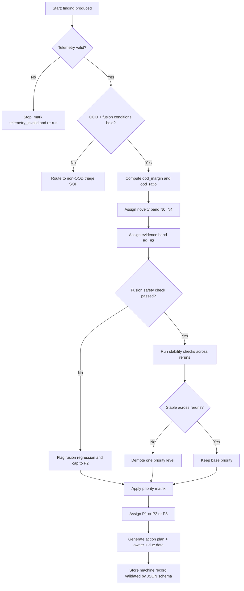

# Analyst SOP: `heuristic_only_ood` Triage

Purpose: classify OOD-backed findings into operational priority buckets (`P1/P2/P3`) without treating OOD as automatic proof.

Scope: use for findings where all are true:

- `cescl_available=true`
- `cescl_is_ood=true`
- `confidence_fusion.source=heuristic_only_ood`
- `confidence_fusion.ood_detected=true`

References:

- Machine schema: `docs/schemas/heuristic_only_ood_triage.schema.json`
- Narrative rubric: `README.md` -> "Heuristic-Only-OOD Triage Rubric + Analyst SOP"

---

## 0) Decision Flow (Mermaid)



---

## 1) Required Capture

Record these fields from JSON/HTML/logs:

- Input file/path
- Vulnerability type
- Severity
- `heuristic_confidence`
- Final `confidence`
- `cescl_ood_score`
- OOD threshold (same run/checkpoint family)
- `confidence_fusion.source`
- `confidence_fusion.ood_detected`
- `taint_flows` count
- Sink evidence snippets
- Source evidence snippets
- Sanitizer evidence (or explicit none)
- Checkpoint/prototype identity (path or artifact hash)

Reject triage (telemetry invalid) if any are true:

- Checkpoint/prototype bundle is unknown or changed mid-comparison
- OOD threshold is missing
- Parsing/analysis had fatal errors

---

## 2) Novelty Band (`N0..N4`)

Compute:

- `ood_margin = cescl_ood_score - ood_threshold`
- `ood_ratio = cescl_ood_score / ood_threshold`

Assign:

- `N0`: `ood_margin <= 0` (not OOD)
- `N1`: `0 < ood_margin <= 0.03` (borderline OOD)
- `N2`: `0.03 < ood_margin <= 0.10` (moderate novelty)
- `N3`: `0.10 < ood_margin <= 0.25` (strong novelty)
- `N4`: `ood_margin > 0.25` (extreme novelty)

Notes:

- Use one threshold family consistently (same checkpoint/prototypes).
- Do not compare margins across incompatible model/prototype versions.

---

## 3) Evidence Band (`E0..E3`)

Assign:

- `E0`: no credible sink/flow chain
- `E1`: sink hit but weak/noisy flow evidence
- `E2`: coherent source->sink evidence with plausible exploit path
- `E3`: strong exploit evidence (high-impact sink family, multiple consistent flows, no effective sanitizer break)

Practical indicators that push toward `E2/E3`:

- HIGH/CRITICAL severity
- Non-trivial and consistent `taint_flows`
- Repeated source->sink edges reaching the claimed sink class
- No convincing sanitizer breakpoints on the active path

---

## 4) Fusion Safety Check

Expected secure behavior for this SOP:

- `confidence_fusion.source=heuristic_only_ood`
- final confidence is approximately equal to heuristic confidence

If final confidence is materially lower than heuristic confidence:

- flag "fusion_regression_suspected"
- cap priority at `P2` until reviewed

---

## 5) Stability Check (Reruns)

Run at least 2 additional times with identical config:

- `cescl_is_ood` remains true
- fusion source remains `heuristic_only_ood`
- vulnerability type and severity remain stable

If unstable:

- mark `unstable_ood=true`
- demote one priority level

---

## 6) Priority Decision Matrix

| Priority | Minimum criteria | Typical action |
| --- | --- | --- |
| `P1` | `N2+` and `E2+` and no telemetry/fusion regression blockers | Immediate senior review, exploitability validation, patch proposal, regression test |
| `P2` | OOD true with moderate novelty/evidence, or gated by fusion/stability concerns | Scheduled analyst review, sink/path confirmation, tune signatures/rules |
| `P3` | OOD true but weak evidence (`E0/E1`) or unstable reruns | Watchlist and clustering; revisit on recurrence |

---

## 7) Machine-Readable Output (JSON Schema)

Canonical schema:

- `docs/schemas/heuristic_only_ood_triage.schema.json`
- Example record:
  - `docs/schemas/examples/heuristic_only_ood_triage.example.json`

Validation examples:

```bash
# Using check-jsonschema (recommended CLI)
check-jsonschema --schemafile docs/schemas/heuristic_only_ood_triage.schema.json triage_record.json

# Validate bundled example
check-jsonschema \
  --schemafile docs/schemas/heuristic_only_ood_triage.schema.json \
  docs/schemas/examples/heuristic_only_ood_triage.example.json
```

```bash
# Using python jsonschema library
python3 - <<'PY'
import json
from jsonschema import Draft202012Validator
schema = json.load(open("docs/schemas/heuristic_only_ood_triage.schema.json"))
record = json.load(open("triage_record.json"))
Draft202012Validator(schema).validate(record)
print("valid")
PY
```

Minimum skeleton:

```json
{
  "schema_version": "1.0.0",
  "case": {
    "case_id": "OOD-2026-0001",
    "analyzed_at_utc": "2026-03-09T00:00:00Z",
    "analyst": "name"
  },
  "input": {
    "source_path": "tests/samples/VUL_OOD_Malicious_ResponseSplitVariant.java",
    "tool_version": "bean-vuln2"
  },
  "signal": {
    "cescl_available": true,
    "cescl_is_ood": true,
    "fusion_source": "heuristic_only_ood",
    "fusion_ood_detected": true,
    "vulnerability_type": "http_response_splitting",
    "severity": "HIGH",
    "scores": {
      "heuristic_confidence": 0.8661,
      "final_confidence": 0.8661,
      "gnn_confidence": 0.7489
    },
    "ood": {
      "ood_score": 2.5409,
      "ood_threshold": 2.4623,
      "ood_margin": 0.0786,
      "ood_ratio": 1.0319,
      "novelty_band": "N2"
    }
  },
  "evidence": {
    "evidence_band": "E3",
    "taint_flows": 9,
    "sink_evidence": ["response.setHeader(... untrusted input ...)"],
    "source_evidence": ["request.getParameter(\"userAgent\")"],
    "sanitizer_evidence": []
  },
  "stability": {
    "reruns_requested": 2,
    "reruns_completed": 2,
    "stable": true,
    "verdict_changes": 0,
    "demoted": false
  },
  "classification": {
    "priority": "P1",
    "rationale": "OOD true with moderate novelty and strong sink/flow evidence."
  },
  "reproducibility": {
    "checkpoint_path": "models/spatial_gnn/best_model.pt",
    "prototype_source": "checkpoint_embedded",
    "command_line": "./bean_vuln2 ... --summary --out ..."
  },
  "decision": {
    "owner": "security-oncall",
    "due_date_utc": "2026-03-10T00:00:00Z",
    "immediate_actions": ["Senior review", "Patch proposal", "Regression test"]
  }
}
```

---

## 8) Analyst Record Template (Copy/Paste)

```text
Case ID:
Date:
Analyst:

Input:
Vulnerability type:
Severity:

heuristic_confidence:
final_confidence:
gnn_confidence:

cescl_ood_score:
ood_threshold:
ood_margin:
ood_ratio:
novelty_band:

fusion_source:
fusion_ood_detected:

taint_flows:
sink evidence:
source evidence:
sanitizer evidence:
evidence_band:

reruns_requested:
reruns_completed:
stable:
verdict_changes:
demoted:

Priority (P1/P2/P3):
Decision rationale:
Owner:
Due date:
Immediate action:
```

---

## 9) Policy Statement

`heuristic_only_ood` means "novel + suspicious," not "confirmed 0-day."
Treat this queue as a high-value manual validation path.
